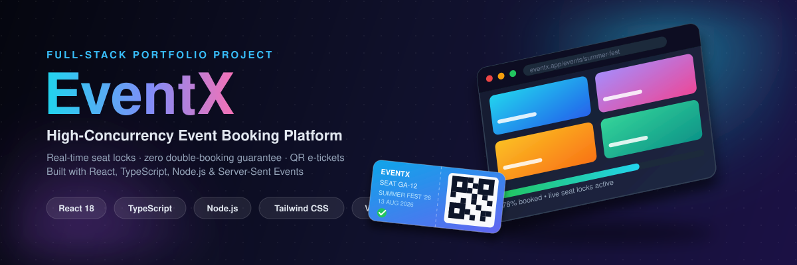
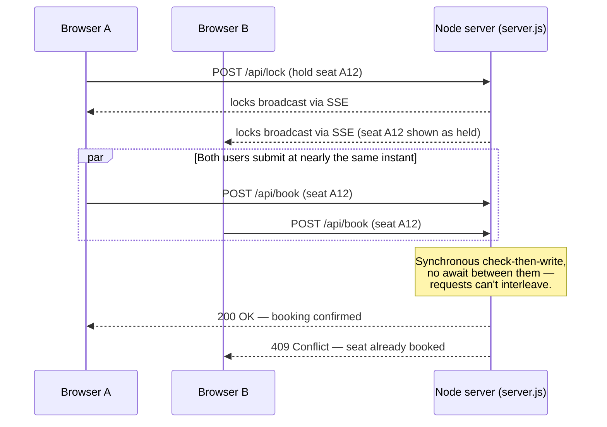

<p align="center">
  
</p>

<h1 align="center">EventX</h1>
<p align="center"><b>A high-concurrency event ticket booking platform</b> — real-time seat locking, an atomic no-double-booking guarantee, and QR-coded PDF e-tickets.</p>

<p align="center">
  <a href="https://nodejs.org/"></a>
  <a href="https://react.dev/"></a>
  <a href="https://www.typescriptlang.org/"></a>
  <a href="https://vitejs.dev/"></a>
  <a href="https://tailwindcss.com/"></a>
  <a href="https://vitest.dev/"></a>
</p>

<p align="center">
  <a href="https://high-concurrency-event-ticket-booki.vercel.app"><b>Live Demo</b></a>
  &nbsp;&middot;&nbsp;
  <a href="#getting-started">Getting Started</a>
  &nbsp;&middot;&nbsp;
  <a href="#architecture--the-concurrency-guarantee">Architecture</a>
  &nbsp;&middot;&nbsp;
  <a href="#key-features">Features</a>
</p>

---

## Overview

EventX is a full-stack, production-style demo of an event ticket booking system built to solve a real distributed-systems problem: **guaranteeing no two people can ever book the same seat**, even under concurrent load — not just a pretty booking UI on top of `localStorage`.

- **Atomic booking backend** — a single-threaded Node HTTP server checks-then-writes each seat with no `await` in between, so two simultaneous requests for the same seat can never interleave; the loser always gets an honest `409 Conflict`.
- **Live cross-tab/cross-device seat locks** over Server-Sent Events (SSE), so a seat someone else is checking out shows as held in real time, without polling.
- **Resilient by design** — if the API is unreachable, the app degrades to a best-effort local mode (Web Locks API + `localStorage`) and visibly banners the user that the double-booking guarantee no longer holds, instead of silently pretending it does.
- **Polished front end** — animated event browsing, seat selection, and a boarding-pass-style PDF ticket with a real QR code, built with React, TypeScript, Tailwind CSS, Radix UI/shadcn, and Framer Motion.

> Events are served from mock data (`src/data/mockData.ts`); bookings, seat locks, and the concurrency guarantee are backed by a real (in-memory) Node server — see [Architecture](#architecture--the-concurrency-guarantee).

---

## Key Features

| Feature | Description |
|---|---|
| **Concurrency-safe booking** | Node backend rejects a seat the instant it's taken (`409`), even under many simultaneous requests. |
| **Real-time seat locks (SSE)** | Selecting a seat broadcasts a short-lived "locked" hold to every connected client so others see it as unavailable while you check out. |
| **Event catalog** | Search by title/venue, filter by category, and browse featured events on the home page. |
| **Event details** | Hero banner, formatted date, venue info, and a live ticket-availability bar. |
| **Booking flow** | Interactive seat picker, ticket count (max 10), live price calculation, and optimistic UI with server reconciliation. |
| **PDF e-ticket** | Generates a downloadable, boarding-pass-style PDF with a scannable QR code, seat numbers, and attendee details. |
| **Authentication** | Login/signup flow with protected routes for user and admin areas. |
| **Admin dashboard** | Create, edit, and delete events; browse all bookings. |
| **Light & dark themes** | Toggleable from the navbar and persisted across visits. |
| **Offline-safe fallback** | Falls back to a `localStorage`-backed mode when the API is unreachable, with a visible banner explaining the reduced guarantee. |
| **Responsive UI** | Mobile-first layout with smooth page transitions and micro-animations. |
| **Automated tests** | Unit and component tests with Vitest and React Testing Library. |

---

## Architecture &mdash; the Concurrency Guarantee

The interesting engineering problem here isn't the UI — it's making sure two people racing for the same seat can't both "win". `server.js` is a deliberately simple, single-threaded Node HTTP server that keeps bookings in memory and does a synchronous check-then-write with no `await` between them, so Node's event loop can never interleave two requests mid-check.



**Why this matters:** the "no double booking" guarantee is enforced by the server, not the browser. If the API isn't running, the client falls back to a best-effort local mode (seat locks/bookings kept in `localStorage`, coordinated with the Web Locks API), but that fallback can only serialize bookings within *one* browser — it has no way to see what another browser or device just booked. A banner appears on the booking page whenever the API is unreachable, precisely because the guarantee doesn't hold in that mode.

**To see it in action:** run `npm run dev` (not just `vite`) and try booking the same seat from two different browser windows.

---

## Tech Stack

| Layer | Technologies |
|---|---|
| **Frontend** | React 18, TypeScript, Vite, React Router, TanStack Query |
| **UI / Styling** | Tailwind CSS, shadcn/ui, Radix UI primitives, Framer Motion, Lucide icons |
| **Forms & Validation** | React Hook Form, Zod |
| **Backend** | Node.js `http` server, Server-Sent Events (SSE) for live state |
| **Tickets** | jsPDF + `qrcode` for QR-coded PDF e-tickets |
| **Testing** | Vitest, React Testing Library, jsdom |
| **Tooling** | ESLint, TypeScript-ESLint, `concurrently` (runs client + API together) |

---

## Getting Started

### Prerequisites
- Node.js 20+
- npm (or bun — a `bun.lock` is included)

### Install & run

```bash
npm install
npm run dev      # starts the Vite dev server AND the booking API together
```

This opens the app at `http://localhost:8080`, with the booking API on `http://localhost:3001`. `npm run dev` runs both concurrently; use `npm run dev:client` / `npm run dev:server` if you want them in separate terminals.

### Available scripts

| Command | Description |
|---|---|
| `npm run dev` | Run the Vite client and the booking API together |
| `npm run dev:client` | Run only the Vite dev server |
| `npm run dev:server` | Run only the booking API (`server.js`) |
| `npm run build` | Production build |
| `npm run preview` | Preview the production build locally |
| `npm run test` | Run the test suite once (Vitest) |
| `npm run test:watch` | Run tests in watch mode |
| `npm run lint` | Lint the codebase |

---

## Project Structure

```
EventX/
├── server.js                  # Atomic booking API + SSE seat-lock broadcaster
├── src/
│   ├── pages/                 # Route-level pages (Home, Event, Booking, Dashboards, Auth)
│   ├── components/             # Reusable UI (Navbar, EventCard, SeatPicker, ui/ primitives)
│   ├── hooks/                  # useAuth, useBookingStore, useSeatLocks, ...
│   ├── utils/                  # generateTicketPDF, seatLockService
│   ├── data/                   # Mock event data
│   └── test/                   # Vitest setup + tests
└── docs/
    └── banner.svg              # README banner
```

---

## Testing

```bash
npm run test        # single run
npm run test:watch  # watch mode
```

Tests cover component behavior and booking logic using Vitest and React Testing Library.

---

## Contributing

Contributions are welcome!

1. Fork the repository.
2. Create a feature branch: `git checkout -b feature/awesome-feature`.
3. Write tests for your changes.
4. Make sure everything passes: `npm run test && npm run lint`.
5. Open a Pull Request describing the change.

---

<p align="center">
  Built by <a href="https://github.com/rohithprem18">@rohithprem18</a> &nbsp;&middot;&nbsp;
  <a href="https://high-concurrency-event-ticket-booki.vercel.app">Live Demo</a>
</p>
