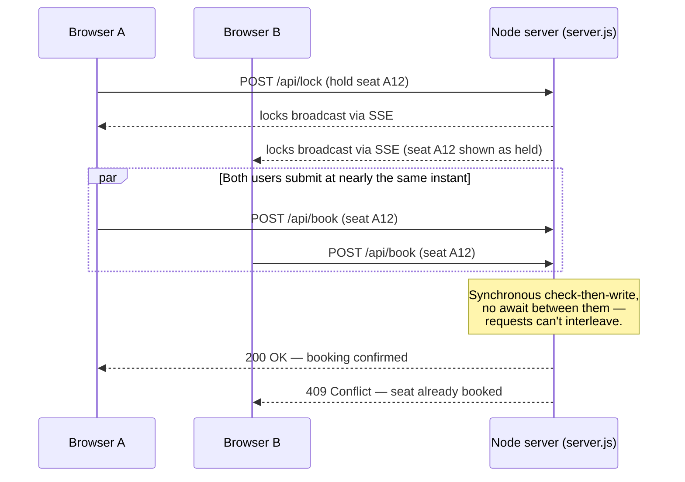

<p align="center">
  <picture>
    <source media="(prefers-color-scheme: dark)" srcset="docs/banner-dark.svg">
    <source media="(prefers-color-scheme: light)" srcset="docs/banner-light.svg">
    
  </picture>
</p>

<p align="center"><a href="https://high-concurrency-event-ticket-booki.vercel.app">Live Demo</a></p>

## Overview

Event ticket booking system where seat correctness is enforced server-side, not by the UI. A single-threaded Node HTTP server performs an atomic check-then-write on every booking request, so two concurrent requests for the same seat cannot both succeed — the loser receives a `409`.

- Seat holds propagate to all connected clients in real time over Server-Sent Events.
- If the API is unreachable, the client falls back to a `localStorage`-backed mode (Web Locks API) and surfaces a banner stating the double-booking guarantee no longer holds — it does not fail silently.
- Event data is mocked (`src/data/mockData.ts`); bookings, locks, and the concurrency guarantee run against a real server (`server.js`).

## Key Features

| Feature | Description |
|---|---|
| Concurrency-safe booking | Server rejects a seat the instant it's taken (`409`), even under simultaneous requests. |
| Real-time seat locks | Seat selection broadcasts a short-lived hold via SSE to every connected client. |
| Booking flow | Seat picker, ticket count limit, live price calculation, optimistic UI with server reconciliation. |
| PDF e-ticket | Boarding-pass-style PDF with a scannable QR code, seat numbers, and attendee details. |
| Auth & roles | Login/signup, protected routes, separate user and admin dashboards. |
| Admin dashboard | Create, edit, delete events; view all bookings. |
| Offline fallback | `localStorage`-backed booking when the API is unreachable, with an explicit reduced-guarantee banner. |
| Light / dark theme | Toggle in the navbar, persisted across sessions. |
| Tests | Unit and component tests via Vitest and React Testing Library. |

## Architecture: the Concurrency Guarantee

`server.js` keeps bookings in memory and performs a synchronous check-then-write with no `await` between the two steps, so Node's single-threaded event loop cannot interleave two requests mid-check.



Run `npm run dev` (client + API together) and attempt to book the same seat from two browser windows to observe this directly.

## Tech Stack

| Layer | Technologies |
|---|---|
| Frontend | React 18, TypeScript, Vite, React Router, TanStack Query |
| UI | Tailwind CSS, shadcn/ui, Radix UI, Framer Motion |
| Forms | React Hook Form, Zod |
| Backend | Node.js `http` server, Server-Sent Events |
| Tickets | jsPDF, `qrcode` |
| Testing | Vitest, React Testing Library |

## Getting Started

Requires Node.js 20+.

```bash
npm install
npm run dev      # Vite client (:8080) + booking API (:3001)
```

| Command | Description |
|---|---|
| `npm run dev` | Client + API together |
| `npm run dev:client` | Vite dev server only |
| `npm run dev:server` | Booking API only |
| `npm run build` | Production build |
| `npm run preview` | Preview production build |
| `npm run test` | Run tests |
| `npm run lint` | Lint |

## Project Structure

```
EventX/
├── server.js              # Atomic booking API + SSE seat-lock broadcaster
├── src/
│   ├── pages/              # Route-level pages
│   ├── components/         # Navbar, EventCard, SeatPicker, ui/ primitives
│   ├── hooks/               # useAuth, useBookingStore, useSeatLocks
│   ├── utils/               # generateTicketPDF, seatLockService
│   └── data/                 # Mock event data
└── docs/                   # README assets
```

---

<p align="center">
  <a href="https://github.com/rohithprem18">@rohithprem18</a>
</p>
