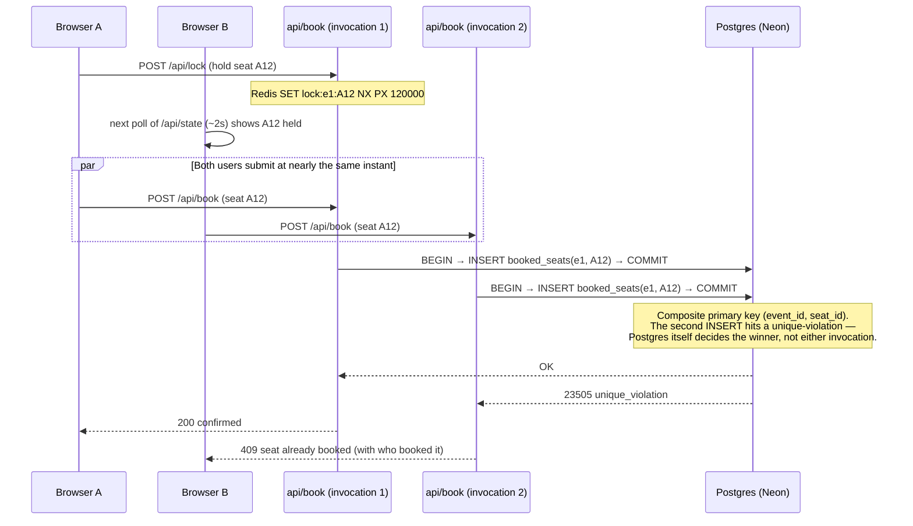

<p align="center">
  <picture>
    <source media="(prefers-color-scheme: dark)" srcset="docs/banner-dark.svg">
    <source media="(prefers-color-scheme: light)" srcset="docs/banner-light.svg">
    
  </picture>
</p>

<p align="center"><a href="https://event-x-ruby-six.vercel.app">Live Demo</a></p>

## Screenshots

| | |
|---|---|
| **Browse events**  | **Event detail**  |
| **Sign in**  | **Create account**  |
| **Seat picker**  | **Booking confirmed**  |
| **User dashboard**  | **Admin — events**  |
| **Admin — bookings**  | **404**  |

## Overview

Event ticket booking system where seat correctness is enforced by the database, not by the UI or by trusting any one function invocation. A Postgres unique constraint makes double-booking a seat impossible even when many serverless invocations are handling requests at once; Redis backs short-lived, self-expiring seat holds.

- Seat holds and new bookings reach every open tab within ~2 seconds via polling — see [Architecture](#architecture-why-this-cant-double-book-or-deadlock) below for why this is polling rather than a pushed stream.
- An abandoned hold (closed tab, a request that never finished) expires on its own within 2 minutes. Nothing can get permanently stuck "locked."
- If the API is unreachable at all, the client falls back to a `localStorage`-backed mode (Web Locks API) and surfaces a banner stating the double-booking guarantee no longer holds — it does not fail silently.
- Event data is mocked (`src/data/mockData.ts`); bookings, seat locks, user accounts, and the concurrency guarantee all run against a real Postgres + Redis backed API (`api/`).
- Accounts are real: passwords are hashed (bcrypt), sessions are a signed httpOnly cookie, verified independently of anything the client claims about itself.

## Key Features

| Feature | Description |
|---|---|
| Concurrency-safe booking | A Postgres unique constraint rejects a seat the instant it's taken (`409`), even across many serverless invocations handling simultaneous requests. |
| Real-time-ish seat locks | Seat selection broadcasts a short-lived, auto-expiring hold; every connected client picks it up on its next ~2s poll. |
| Booking flow | Seat picker, ticket count limit, live price calculation, optimistic UI with server reconciliation. |
| PDF e-ticket | Boarding-pass-style PDF with a scannable QR code, seat numbers, and attendee details. |
| Auth & roles | Real registration/login (`api/auth/`) — bcrypt-hashed passwords, a signed httpOnly session cookie, protected routes, separate user and admin dashboards. |
| Admin dashboard | Create, edit, delete events; view all bookings. |
| Offline fallback | `localStorage`-backed booking when the API is unreachable, with an explicit reduced-guarantee banner. |
| Light / dark theme | Toggle in the navbar, persisted across sessions. |
| Tests | Unit and component tests via Vitest and React Testing Library. |

## Architecture: why this can't double-book or deadlock

The backend is Vercel serverless functions (`api/`) — no long-lived process, so nothing in the request path can hold state in memory between requests or keep a connection open indefinitely (no SSE stream, no Redis `SUBSCRIBE`). Correctness and real-time sync both had to be redesigned around that, deliberately kept as two separate concerns:

- **Correctness** — a Postgres unique constraint on `booked_seats(event_id, seat_id)` (`api/_lib/db.js`, using [`@neondatabase/serverless`](https://github.com/neondatabase/serverless), Neon's own driver — a drop-in for node-postgres that talks over WebSocket instead of raw TCP, which is what makes a connection pool safe to use from a function that can be frozen and recycled between invocations). A second `INSERT` for an already-booked seat is rejected by the database itself, inside a transaction, no matter how many invocations are running. This is the actual source of truth; nothing else in the system is trusted to prevent a double-booking.
- **Seat-hold UX** — Redis locks (`api/_lib/redis.js`, using [`@upstash/redis`](https://github.com/upstash/redis-js), which issues plain HTTPS requests instead of needing a persistent connection — also required for a serverless function). `SET key value NX PX 120000` acquires a hold *only if free* and auto-expires it in 2 minutes, atomically, in one command. There's no separate cleanup job and no way for a hold to survive an abandoned tab or a function invocation that never finishes — Redis expires it regardless of what happened to whoever created it.
- **Sync** — the client polls `GET /api/state` every ~2s (`src/hooks/useBookingStore.tsx`) instead of receiving a push. This is the one real tradeoff of going fully serverless: a few seconds of latency on seeing someone *else's* hold, instead of instant. The booking decision itself is never affected by this — that's Postgres, synchronously, on the request that matters.



Why an abandoned hold can't cause a "stuck" seat: Redis TTLs expire on their own, independent of whatever created them, so a function invocation that dies mid-flow or a browser tab closed mid-booking self-heals in under 2 minutes with zero intervention. Why there's no deadlock: every lock acquisition is a single non-blocking atomic command (nothing ever waits *on* another lock while holding one), and every seat insert in a multi-seat booking is committed as one all-or-nothing transaction — there is no ordering for two holders to deadlock over.

This was verified directly, not just reasoned about: the exact schema and transaction logic in `api/_lib/db.js` was run against a real local Postgres with two connections racing for the same seat — exactly one committed, the other hit the unique-violation and rolled back cleanly, with no partial multi-seat booking ever observable. The Redis lock-diff algorithm in `api/_lib/redis.js` was likewise run against a real local Redis: a second user is correctly blocked from a held seat, releasing a selection correctly frees only what was given up, and an abandoned lock expires on its own. (Both used the plain `pg`/`ioredis` clients for that local check, since `@neondatabase/serverless` and `@upstash/redis` specifically need a live Neon/Upstash endpoint to connect through — same SQL and same Redis commands either way, only the transport differs.)

## Authentication

Real accounts, not the localStorage-mock this project started with — `api/auth/{register,login,logout,me}.js`, backed by a `users` table in the same Postgres database (`api/_lib/auth.js`).

- Passwords are hashed with `bcrypt` (never stored or logged in plaintext) and compared with `bcrypt.compare` — a wrong password and a nonexistent email get the same generic "Invalid email or password", so a login attempt can't be used to enumerate registered accounts.
- A session is a JWT signed with `JWT_SECRET`, set as an `HttpOnly; Secure; SameSite=Lax` cookie — not readable from client JS, not sent cross-site, and stateless to verify (no session-table lookup on every request, just a signature + expiry check). `GET /api/auth/me` restores it on page load so a refresh doesn't log you out.
- The email column is `UNIQUE`; a duplicate registration is rejected by Postgres itself (`23505`), the same pattern as the seat-booking guarantee.
- A demo admin account is seeded automatically (`admin@example.com` / `admin1234`, shown on the login page) so the live deploy has an admin dashboard to look at without registering first — an intentionally public credential for a portfolio project, not a real account with anything at stake.

## Tech Stack

| Layer | Technologies |
|---|---|
| Frontend | React 18, TypeScript, Vite, React Router |
| UI | Tailwind CSS (hand-owned components, no external UI kit), Framer Motion, self-hosted Outfit / JetBrains Mono |
| Backend | Vercel Serverless Functions (`api/`), Node.js |
| Data | Postgres via [Neon](https://neon.tech) (`@neondatabase/serverless`) — bookings, users, the double-booking constraint · Redis via [Upstash](https://upstash.com) (`@upstash/redis`) — seat locks |
| Auth | `bcryptjs` (password hashing), `jose` (JWT sessions) |
| Tickets | jsPDF, `qrcode` |
| Testing | Vitest, React Testing Library |

## Getting Started

Requires Node.js 20+, the [Vercel CLI](https://vercel.com/docs/cli) (installed as a dev dependency, so `npx vercel` works with no global install), and a Vercel account linked to this project (`vercel link`) so `vercel dev` can pull down real `DATABASE_URL` / Upstash env vars — see [Deployment](#deployment) for provisioning those.

```bash
npm install
npx vercel link      # first time only — links this folder to your Vercel project
npx vercel env pull  # writes .env.local with the real Neon/Upstash values
npm run dev           # vercel dev — frontend + api/ together on one port
```

Without linking to a Vercel project, `npm run dev:client` (Vite alone) still works — the UI falls back to `localStorage`-backed booking with a visible "server unreachable" banner, which is enough to browse, book, and preview every screen with no backend at all.

| Command | Description |
|---|---|
| `npm run dev` | `vercel dev` — frontend + `api/` functions together (needs `.env.local`, see above) |
| `npm run dev:client` | Vite dev server only — works with no backend, local-fallback mode |
| `npm run build` | Production build |
| `npm run preview` | Preview production build |
| `npm run test` | Run tests |
| `npm run lint` | Lint |

## Deployment

Frontend and backend deploy together as one Vercel project — a static build plus the `api/` folder as serverless functions, wired by `vercel.json`.

1. **Postgres — Neon.** If you've added the [Neon integration](https://vercel.com/marketplace/neon) from the Vercel dashboard to this project already, `DATABASE_URL` is set for you automatically — nothing to do. Otherwise: Storage tab → Create Database → Neon.
2. **Redis — Upstash.** Add the [Upstash integration](https://vercel.com/marketplace/upstash) the same way (Storage tab → Create Database → Upstash → Redis). It sets `UPSTASH_REDIS_REST_URL` and `UPSTASH_REDIS_REST_TOKEN` (or `KV_REST_API_URL` / `KV_REST_API_TOKEN` if added via the "KV" product naming — `api/_lib/redis.js` reads either), which `Redis.fromEnv()` picks up automatically — nothing to configure by hand.
3. **Auth secret.** The one env var neither integration sets: generate one (`openssl rand -base64 32`) and add it as `JWT_SECRET` in the Vercel project's Environment Variables. Without it, every `api/auth/*` request throws on cold start.
4. Deploy (`git push` if the repo is already connected to a Vercel project, or `npx vercel --prod`). `api/_lib/db.js` applies the Postgres schema itself on first request (`CREATE TABLE IF NOT EXISTS`), including seeding the demo admin account — no separate migration step.
5. That's it — no `VITE_API_URL`, no CORS config. Frontend and API are the same origin by construction.

Because correctness lives in Postgres and locks live in Redis rather than in any one invocation's memory, this scales to however many concurrent invocations Vercel runs without reintroducing double-booking — that's the whole point of the design in [Architecture](#architecture-why-this-cant-double-book-or-deadlock).

## Project Structure

```
EventX/
├── api/
│   ├── _lib/
│   │   ├── db.js             # Postgres: schema, commitBooking (the guarantee), users
│   │   ├── redis.js           # Redis: seat locks (TTL)
│   │   └── auth.js             # bcrypt hashing, JWT session cookies
│   ├── auth/
│   │   ├── register.js         # POST — hash password, create user, set session
│   │   ├── login.js             # POST — verify password, set session
│   │   ├── logout.js             # POST — clear session
│   │   └── me.js                  # GET  — restore session on page load
│   ├── state.js               # GET  — polled every ~2s by the client
│   ├── lock.js                 # POST — acquire/replace a user's seat holds
│   ├── unlock.js                # POST — release a user's seat holds
│   ├── book.js                   # POST — the atomic booking transaction
│   └── health.js
├── vercel.json               # SPA rewrite: non-/api paths → index.html
├── src/
│   ├── pages/              # Route-level pages
│   ├── components/         # Navbar, EventCard, SeatPicker, CreateEventForm
│   ├── hooks/               # useAuth, useBookingStore, useSeatLocks
│   ├── utils/               # generateTicketPDF, seatLockService
│   └── data/                 # Mock event data
└── docs/                   # README assets
```

---

<p align="center">
  <a href="https://github.com/rohithprem18">@rohithprem18</a>
</p>
