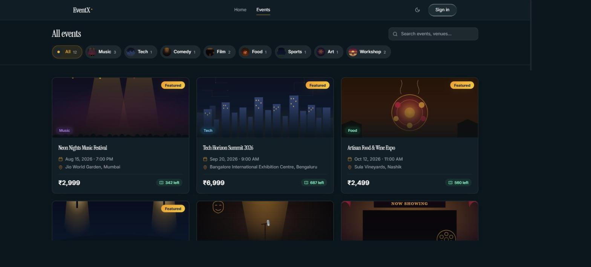
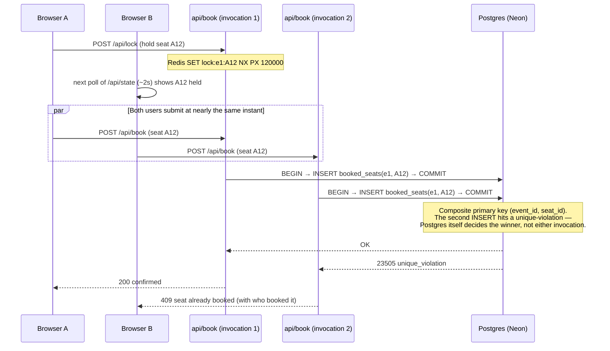
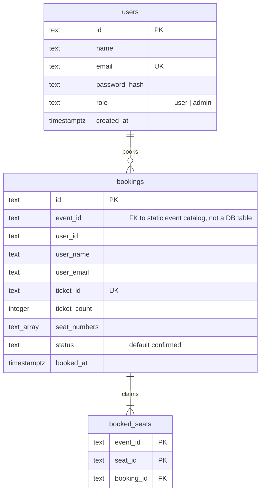

  <picture>
    <source media="(prefers-color-scheme: dark)" srcset="docs/banner-dark.svg">
    <source media="(prefers-color-scheme: light)" srcset="docs/banner-light.svg">
    
  </picture>

<a href="https://event-x-ruby-six.vercel.app">Live Demo</a>

## Overview

EventX is an event ticket booking platform built around one guarantee: a seat can never be sold twice, no matter how many people try to book it at the same instant. That guarantee is enforced by the database itself — a Postgres unique constraint on `(event_id, seat_id)` — not by application logic, locking assumptions, or client trust.

- Seat holds and confirmed bookings propagate to every open tab within ~2 seconds.
- An abandoned hold releases itself within 2 minutes — nothing can get permanently stuck.
- Accounts are real: passwords are hashed with bcrypt, sessions are signed, httpOnly JWT cookies.
- If the booking API is unreachable, the client degrades to a local fallback mode with a visible warning rather than failing silently.

## Screenshots

| | |
|---|---|
| **Browse events**  | **Event detail**  |
| **Sign in**  | **Create account**  |
| **Seat picker**  | **Booking confirmed**  |
| **User dashboard**  | **Admin — events**  |
| **Admin — bookings**  | **404**  |

## Key Features

| Feature | Description |
|---|---|
| Concurrency-safe booking | A Postgres unique constraint rejects an already-taken seat instantly (`409`), even under simultaneous requests across serverless invocations. |
| Live seat locks | Seat selection broadcasts a short-lived, auto-expiring hold; every connected client picks it up on its next poll. |
| Event discovery | Cinematic single-viewport home leads into a dedicated `/events` page — search plus horizontal category filter chips, results updating in place. |
| Booking flow | Seat picker, ticket limits, live price calculation, optimistic UI with server reconciliation. |
| PDF e-tickets | Boarding-pass-style PDF with a scannable QR code, seat numbers, and attendee details. |
| Authentication & roles | bcrypt-hashed passwords, signed httpOnly session cookies, protected routes, separate user and admin dashboards. |
| Admin dashboard | Create, edit, and delete events; view and manage all bookings. |
| Offline fallback | Local-storage-backed booking when the API is unreachable, with an explicit reduced-guarantee warning. |
| Light / dark theme | Toggle in the navbar, persisted across sessions. |
| Fully responsive | Optimized layouts from small phones through desktop, including the seat-picker grid. |

## Architecture: why this can't double-book or deadlock

The backend runs as Vercel serverless functions — no long-lived process, so nothing in the request path can hold state in memory between requests. Correctness and real-time sync are deliberately separated:

- **Correctness** — a Postgres unique constraint on `booked_seats(event_id, seat_id)`, via [`@neondatabase/serverless`](https://github.com/neondatabase/serverless). A second `INSERT` for an already-booked seat is rejected by the database itself, inside a transaction, regardless of how many invocations are running concurrently. This is the actual source of truth for the double-booking guarantee.
- **Seat-hold UX** — Redis locks via [`@upstash/redis`](https://github.com/upstash/redis-js). `SET key value NX PX 120000` acquires a hold only if free and auto-expires it in 2 minutes, atomically, in a single command — no cleanup job required.
- **Sync** — the client polls `GET /api/state` every ~2s rather than holding a persistent connection, the one real tradeoff of a fully serverless design. The booking decision itself is never affected by this latency — that happens synchronously against Postgres, on the request that matters.

The guarantee holds under an abandoned hold or a mid-flow failure too: Redis TTLs expire independently of whatever created them, and every multi-seat booking commits as one all-or-nothing transaction — there's no ordering for two holders to deadlock over. This was verified directly against a real local Postgres and Redis instance, not just reasoned about: two connections racing for the same seat resolve to exactly one winner, with no partial booking ever observable.

## Database Schema

Three tables in Postgres (Neon), created idempotently on cold start by `api/_lib/db.js`. Seat holds live in Redis, not here — they're transient by design (see above).

- **`users`** — real accounts. `email` is `UNIQUE`, so duplicate registration is rejected by Postgres itself. `password_hash` is bcrypt output, never sent to the client (`db.js` strips it outside the login path).
- **`bookings`** — one row per checkout. `ticket_id` is the human-facing ID printed on the PDF ticket and shown in both dashboards; `seat_numbers` is a Postgres `TEXT[]`, so a multi-seat booking is still one row.
- **`booked_seats`** — the concurrency guarantee itself. Composite primary key `(event_id, seat_id)` means a second `INSERT` for an already-claimed seat is rejected with a `23505 unique_violation` before it can ever reach `bookings`; `ON DELETE CASCADE` from `bookings` keeps the two tables consistent if a booking is ever removed.
- Events themselves aren't a database table — the catalog is static seed data shipped with the client (see `src/data/`), so `event_id` is a plain string with no FK enforcement, not a schema oversight.

## API Endpoints

All routes are Vercel serverless functions under `api/`, deployed as individual functions. Auth endpoints set/clear an `HttpOnly` session cookie; everything else is stateless.

| Method | Path | Auth | Description |
|---|---|---|---|
| `POST` | `/api/auth/register` | — | Create an account (bcrypt-hash the password, reject duplicate email with `409`), sign in immediately. |
| `POST` | `/api/auth/login` | — | Verify credentials, set the session cookie. Same generic `401` for a wrong password or an unknown email. |
| `POST` | `/api/auth/logout` | — | Clear the session cookie. |
| `GET` | `/api/auth/me` | cookie | Current session's user, or `{ user: null }` — never errors just for being logged out. |
| `GET` | `/api/state` | — | Polled every ~2s by the client: all bookings plus all active Redis seat locks, in one payload, so the UI can reconcile without a persistent connection. |
| `POST` | `/api/lock` | — | Acquire a short-lived hold (`SET NX PX 120000`, 2 min TTL) on the seats a user has selected. |
| `POST` | `/api/unlock` | — | Release a user's held seats early (e.g. they navigate away or clear their selection). |
| `POST` | `/api/book` | — | Commit a booking inside one Postgres transaction. `409` with `{ seats, bookedBy }` on a real seat collision; on success, also clears that user's Redis locks server-side. |
| `GET` | `/api/health` | — | Liveness probe — `{ ok: true }`, no dependency checks. |

## Authentication

Real accounts, backed by a `users` table in the same Postgres database.

- Passwords are hashed with bcrypt and never stored or logged in plaintext; a wrong password and a nonexistent email return the same generic error, so login attempts can't be used to enumerate accounts.
- Sessions are a JWT signed with a server secret, set as an `HttpOnly; Secure; SameSite=Lax` cookie — not readable from client JS, stateless to verify.
- The email column is `UNIQUE`; duplicate registration is rejected by Postgres itself, the same pattern used for the seat-booking guarantee.
- A demo admin account (`admin@example.com` / `admin1234`, shown on the login page) is seeded automatically for evaluating the admin dashboard without registering first.

## Tech Stack

| Layer | Technologies |
|---|---|
| Frontend | React 18, TypeScript, Vite, React Router |
| UI | Tailwind CSS, Framer Motion, self-hosted Instrument Serif (display) / Inter (body) |
| Backend | Vercel Serverless Functions, Node.js |
| Data | Postgres via [Neon](https://neon.tech) — bookings, users, the double-booking constraint · Redis via [Upstash](https://upstash.com) — seat locks |
| Auth | `bcryptjs`, `jose` (JWT sessions) |
| Tickets | jsPDF, `qrcode` |
| Testing | Vitest, React Testing Library |

---

  <a href="https://github.com/rohithprem18/EventX">GitHub</a> ·
  <a href="https://github.com/rohithprem18">@rohithprem18</a>

